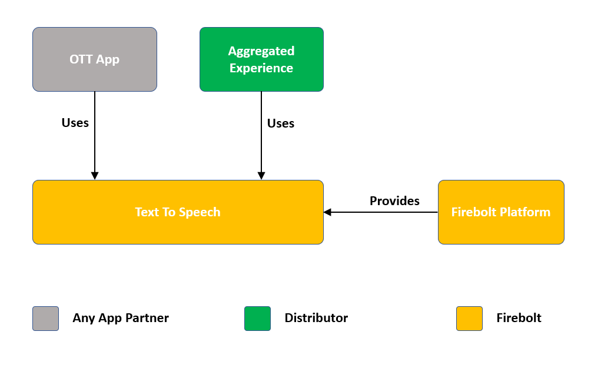

# Text To Speech

Document status: Draft

See [Firebolt Requirements Governance](../../../governance.md) for more info.

| Contributor    | Organization   |
| -------------- | -------------- |
| Ramasamy Thalavay Pillai | Comcast |

## 1. Overview

This document describes the requirements for Firebolt "Text To Speech" Component. All UI Applications - viz., Aggregated Experience, Trusted Apps and OTT Apps - require to "speak" the screen as the user navigates, so that they could offer "voice guided" navigation experience to those users who are visually impaired or have low vision.

Voice Guidance is typically achieved by the UI applications by passing a text to FireBolt which then converted into a speech and played out. Occassionally,the UI applications may also want to play a sound by directly passing the audio file that has the required sound (ex: Haptic Sound)

Functionally, Text to Speech enables apps to have the following capabilities:

* Start the Text to Speech Playback, Cancel the playback, Pause and resume the Playback
* Playback related notifications such as speech started, speech ended or other notification such as voice changed, speech rate changed etc. 
* Apps may require to know what state the speech is currently in - for example, Pending, InProgress, Paused, or Complete. 
* App might also want to know the set of supported voices that playback could use along with the corresponding languages

In addition to the above capabilities, there are more sensitive operations such as ability to enable / disable voice guidance, change the language or voice used, change the speech rate or volume of the speech, etc. These are typically made accessible only to the aggregated experience App or trusted app (distributor app) and is covered in another separate specification (Voice Guidance, To Do: Provide cross reference link here) and hence they are not in the scope of Text To Speech specification.

## 2. Table of Contents
- [1. Overview](#1-overview)
- [2. Table of Contents](#2-table-of-contents)
- [3. TTS Playback](#3-tts-playback)
  - [3.1. Start Playback](#31-start-playback)
  - [3.2. Pause Playback](#32-pause-playback)
  - [3.3. Resume Playback](#33-resume-playback)
  - [3.4. Cancel Playback](#34-cancel-playback)
- [4. Speech State](#5-speech-state)
- [5. Languages and voices](#6-languages-and-voices)
- [6. Schemas](#6-schemas)
- [7. APIs](#7-apis)
  - [7.1. Core SDK APIs](#71-core-sdk-apis)
    - [7.1.1. TTS Object](#711-tts-object)
    - [7.1.2. Speak Method](#712-speak-method)
    - [7.1.3. Pause Method](#713-pause-method)
    - [7.1.4. Resume Method](#714-Resume-method)
    - [7.1.5. Cancel Method](#715-cancel-method)
    - [7.1.6. Speechrate Method](#716-speechrate-method)
    - [7.1.7. voices Method](#717-voices-method)

## 3. TTS Playback

As described in the Overview, Text To Speech allows any given application to pass a text and convert that into a speech, and then playback the speech.

The following are the set of actions that can be perforned on the Firebolt Text To Speech APIs.

### 3.1. Start Playback

An app SHALL initiate a **Speech session** by using the speak method and passing the text that needs to be converted into speech. Each Speech session has an associated **speech id** that will be returned to the application(s) upon successful initiation of the speech session. The Text that is passed to the Firebolt TTS may be a normal text or in SSML compliant format.

Speak method may result in number of notifications, as mentioned below, depending on the states that the speak request goes through in its life cycle until the speech session ends: 
* Will Speak: The speech request is accepted and a speech session is created for further processing of the text passed.
* Speech Starts: Conversion process of text into speech starts.
* Speech Interrupted: Happens when speech is already in-progress. Current speech is interrupted either by another speech request, or by calling the cancel method, or by disabling TTS (using Voice Guidance methods by Distributor App).
* Speech Complete: Triggered when the speech complete. Marks the end of the speech session.
* Network Error: Triggered when the device is facing temporary or permanant network failure and hence is not able to start the text to speech conversion using the TTS cloud endpoint.
* Playback Error: The text is successfully converted into a speech, however there is a failure at platform level in playing the converted speech.

To Do: Add details for multiple languages support here(?)

### 3.2. Pause Playback

A speech session shall be paused (when the corresponding playback is in progress) by explicitely asking the Firebolt TTS to pause the speech by providing the **speech id**. If there is no speech to be paused (for ex., the speech may have already ended), the firebolt TTS handles that request gracefully and returns appropraite response.

Pause method may result in the folllowing notification: 
* Speech Paused: Triggered when the speech is successfully paused.

### 3.3. Resume Playback

A speech session shall be resumed (when it has been paused previously) by explicitely asking the Firebolt TTS to resume the speech by providing the **speech id**.

Resume method may result in the folllowing notification: 
* Speech resumed: Triggered when the speech is successfully paused.

### 3.4. Cancel Playback

A speech session shall be cancelled by explicitely asking the Firebolt TTS to cancel the ongoing or paused speech by providing the **speech id**.

Resume method may result in the folllowing notification: 
* Speech interrupted: Triggered when the speech speech session is successfully stopped. Also marks the end of the session.

## 4. Speech State

Firebolt TTS Speech goes through differnt states in it's life cycle, and includes the following:
* Pending - The Speech has not stated yet, but the conversion process is in place, or the request is in queue (To DO: Should we support queueing of multiple Speech Requests?) 
* InProgress - Speech is in progress
* Paused - Speech is currently paused
* NotFound - Speech already completed and the session is no longer valid

The current state of the  SHALL be rtrieved by the application using Firebolt TTS APIs by passing the  **speech id**

## 6. Languages and voices

The Firebolt TTS supports playing back the text in multiple languages (and multiple voices for each of the languages). While the selection of exact language and voice to be used is determined by the Distributor app(s) (using Firebolt Voice Guidance), all apps including partner apps SHALL be able to retrieve the supported languages and voices.

## 7. Schemas

To Do!

## 8. APIs

APIs for Text To Speech are covered in ......

### 8.1. Manage SDK APIs

These APIs are intended for all firebolt apps - trusted as well as partner apps.

#### 8.1.1. TTS Object

To DO

#### 8.1.2. Speak Method

To DO

#### 8.1.3. Pause Method

To DO

#### 8.1.4. Resume Method

To DO

#### 8.1.5. Cancel Method

To DO

#### 8.1.6. Speechrate Method

To DO

#### 8.1.7. voices Method

To DO
