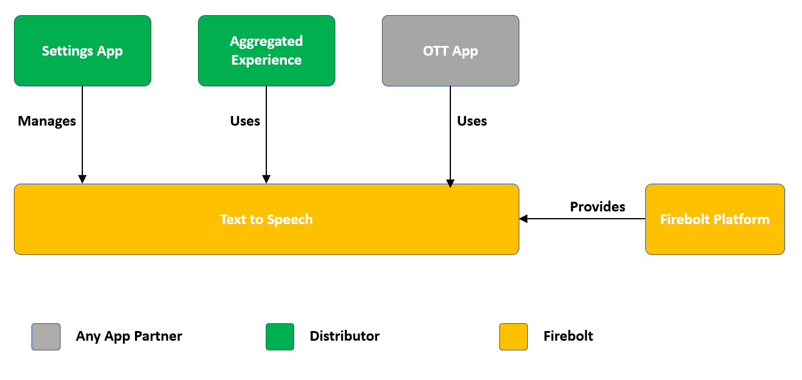

# Text to Speech

Document status: Draft

See [Firebolt Requirements Governance](../governance.md) for more info.

| Contributor    | Organization   |
| -------------- | -------------- |
| Ramasamy Thalavay Pillai | Comcast |

## 1. Overview

This document is focussing on "text to speech" (TTS) as one of the Firebolt features, and describes the requirements for the same in terms of capabilities and various operations that the Firebolt TTS offers to Firebolt apps. This is not to be confused with Firebolt accessibility module that provides capabilities related to various accessibility features viz., closed caption and voice guidance. 

All UI Applications - viz., Aggregated Experience, Trusted Apps and OTT Apps - require to "speak" either the screen content or something contextual as the user navigates, so that they could offer "text to speech" as a feature as part of "voice guided navigation experience" or "other similar experiences" to those users who are visually impaired or have low vision, or to those users who prefers to navigate the device in this manner.

Text to Speech is typically achieved by the UI applications by passing a text to FireBolt which is then converted into a speech and played out. Occassionally,the UI applications may also want to play a sound by directly passing the audio file that has the required sound (ex: Haptic Sound).

Functionally, Text to Speech enables apps to have the following capabilities:

* Start the Text to Speech Playback, Cancel the playback, Pause and resume the Playback
* Playback related notifications such as speech started, speech ended or other notification such as voice changed, speech rate changed etc. 
* Apps may require to know what state the speech is currently in - for example, Pending, InProgress, Paused, or Complete. 
* App might also want to know the set of supported voices that the playback could use along with the corresponding languages

In addition to the above capabilities, there are more sensitive operations such as ability to change the language or voice used, change the speech rate or volume of the speech, etc. These are typically made accessible to all apps, however modifiable only by the distributor apps (either a separate settings app or the aggregated experience App or any other trusted distributor app) and exposed through manage SDK.

There are several native applications that require access to the Firebolt TTS Interface so the Firebolt TTS component interface shall be made available to native apps as part of "firebolt native sdk".

## 2. Table of Contents
- [1. Overview](#1-overview)
- [2. Table of Contents](#2-table-of-contents)
- [3. Text to Speech Settings](#3-tts-settings)
- [4. Text to Speech Playback](#4-tts-playback)
  - [4.1. Start Playback](#41-start-playback)
  - [4.2. Pause Playback](#42-pause-playback)
  - [4.3. Resume Playback](#43-resume-playback)
  - [4.4. Cancel Playback](#44-cancel-playback)
  - [4.5. Speech State](#5-speech-state)
- [5. Schemas](#5-schemas)
- [6. APIs](#6-apis)
  - [6.1. Core SDK APIs](#61-core-sdk-apis)
    - [6.1.1. TTS Settings Object](#611-ttssettings-object)
	- [6.1.2. TTS Playback Object](#612-ttsplayback-object)
	  - [6.1.2.1. Speak Method](#6121-speak-method)
      - [6.1.2.2. Pause Method](#6122-pause-method)
      - [6.1.2.3. Resume Method](#6123-Resume-method)
      - [6.1.2.4 Cancel Method](#6124-cancel-method)
  - [6.2. Manage SDK APIs](#62-manage-sdk-apis)
    - [6.2.1. TTS Settings Object](#621-ttssettings-object)

## 3. Text to Speech Settings

Text to Speech settings shall include the following:
* speechrate:
  * Description: The speech rate of the voice
  * type: string 
  * Get / Set Support: Both get and set are supported
  * Notifications: onspeechratechanged
* language:
  * Description: The current selection of the language in which the text to be spoken with. IETF BCP 47 code, ex: en-US
  * type: string 
  * Get / Set Support: Both get and set are supported
  * Notifications: onlanguagechanged
* voice:
  * Description: The voice corresponds to the currently selected language. Should be one of the system supported voice. Please refer "voicelist" method
  * type: string 
  * Get / Set Support: Both get and set are supported
  * Notifications: onvoicechanged
* ttsvolume:
  * Description: The volume of the voice guidance voice (number - 1 to 100)
  * type: number 
  * Get / Set Support: Both get and set are supported
  * Notifications: onvolumechanged
* playervolume:
  * Description: The volume of the primary player volume during the tts playback (number - 1 to 100)
  * type: number 
  * Get / Set Support: Only set is supported
  * Notifications: N/A
* fallbacktext:
  * Description: Text that needs to be converted into voice and spoken, whenever there is a temporary issue in converting the passed text. For ex: tts engine not reachable.
  * type: string 
  * Get / Set Support: Only set is supported
  * Notifications: N/A
* voicelist:
  * Description: The list of supported languages and the corresponding voices (ex: en-US language that has support for two voices "Ava" and "carol")
  * type: array 
  * Get / Set Support: Only get is supported
  * Notifications: N/A
  
The "Set" for all of the above properties are made available through manage sdk, where as "get" is made available through core sdk.

## 4. Text to Speech Playback

As described in the Overview, Firebolt TTS allows any given application to pass a text and convert that into a speech, and then playback the speech.

The following are the set of actions that can be performed on the Firebolt Text to Speech APIs.

### 4.1. Start Playback

An app SHALL initiate a **Speech session** by passing the text (that needs to be converted into speech) using the speak method. Each Speech session has an associated **speech id** that will be returned to the application(s) upon successful initiation of the speech session. The Text that is passed to the Firebolt TTS may be a normal text or in SSML compliant format.

Speak method may result in number of notifications, as mentioned below, depending on the states that the speak request goes through in its life cycle until the speech session ends: 
* Will Speak: The speech request is accepted and a speech session is created for further processing of the text passed.
* Speech Starts: Conversion process of text into speech starts.
* Speech Interrupted: Happens when speech is already in-progress. Current speech is interrupted either by another speech request, or by calling the cancel method, or by disabling TTS (by Distributor App).
* Speech Complete: Triggered when the speech complete. Marks the end of the speech session.
* Network Error: Triggered when the device is facing temporary or permanant network failure and hence is not able to start the text to speech conversion using the TTS cloud endpoint.
* Playback Error: The text is successfully converted into a speech, however there is a failure at platform level in playing the converted speech.

To Do: Add details or references to these notifiations.

### 4.2. Pause Playback

A speech session shall be paused (when the corresponding playback is in progress) by explicitely asking the Firebolt TTS to pause the speech by providing the **speech id**. If there is no speech to be paused (for ex., the speech may have already ended), the Firebolt TTS handles that request gracefully and returns appropraite response.

Pause method may result in the folllowing notification: 
* Speech Paused: Triggered when the speech is successfully paused.

To Do: Add details or references to these notifiations.

### 4.3. Resume Playback

A speech session shall be resumed (when it has been paused previously) by explicitely asking the Firebolt TTS to resume the speech by providing the **speech id**.

Resume method may result in the folllowing notification: 
* Speech resumed: Triggered when the speech is successfully paused.

To Do: Add details or references to these notifiations.

### 4.4. Cancel Playback

A speech session shall be cancelled by explicitely asking the Firebolt TTS to cancel the ongoing or paused speech by providing the **speech id**.

Resume method may result in the folllowing notification: 
* Speech interrupted: Triggered when the speech speech session is successfully stopped. Also marks the end of the session.

To Do: Add details or references to these notifiations.

### 4.5. Speech State

Firebolt TTS Speech goes through differnt states in it's life cycle, and includes the following:
* Pending - The Speech has not stated yet, but the conversion process is in place, or the request is in queue (To DO: Should we support queueing of multiple Speech Requests?) 
* InProgress - Speech is in progress
* Paused - Speech is currently paused
* NotFound - Speech already completed and the session is no longer valid

The current state of the speech session SHALL be rtrieved by the application using Firebolt TTS APIs by passing the  **speech id**

## 5. Schemas

To Do!

## 6. APIs

APIs for Text To Speech are covered in ......

### 6.1. Core SDK APIs

These APIs are intended for all Firebolt apps - trusted as well as partner apps.

#### 6.1.1. TTS Settings Object

To DO

#### 6.1.2. TTS Playback Object

To DO

##### 6.1.2.1. Speak Method

To DO

##### 6.1.2.2. Pause Method

To DO

##### 6.1.2.3. Resume Method

To DO

##### 6.1.2.4 Cancel Method

To DO

### 6.2. Manage SDK APIs

These APIs are intended for trusted apps only.

#### 6.2.1. TTS Settings Object

To DO
